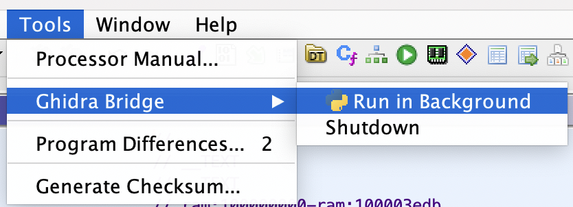
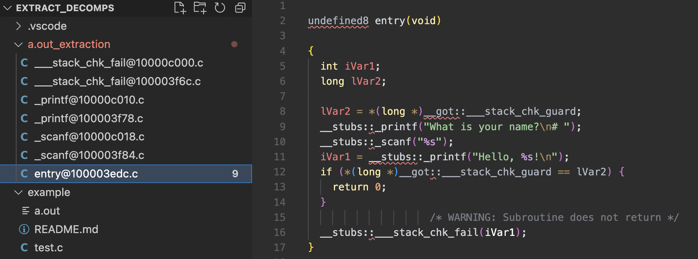

This example is provided as a quick sanity check to verify that everything is installed and working correctly.

## Build Example

```
$ gcc test.c
$ ./a.out
What is your name?
# dino
Hello, dino!
```

## Running Extract Script

1. Open `a.out` in Ghidra

2. Run auto-analysis within Ghidra

3. Start the Ghidra Bridge

   

4. Run the extraction script

   ```
   $ python extract.py
   INFO:root:Program Name: a.out
   INFO:root:Creation Date: Tue Jul 26 13:51:21 EDT 2022
   INFO:root:Language ID: AARCH64:LE:64:AppleSilicon
   INFO:root:Compiler Spec ID: default
   INFO:root:Using 'a.out_extraction' as output directory...
   INFO:root:Extracting decompiled functions...
   INFO:root:Extracted 7 out of 7 functions
   
   $ tree a.out_extraction
   a.out_extraction
   ├── ___stack_chk_fail@100003f6c.c
   ├── ___stack_chk_fail@10000c000.c
   ├── _printf@100003f78.c
   ├── _printf@10000c010.c
   ├── _scanf@100003f84.c
   ├── _scanf@10000c018.c
   └── entry@100003edc.c
   ```

5. Verify output as needed